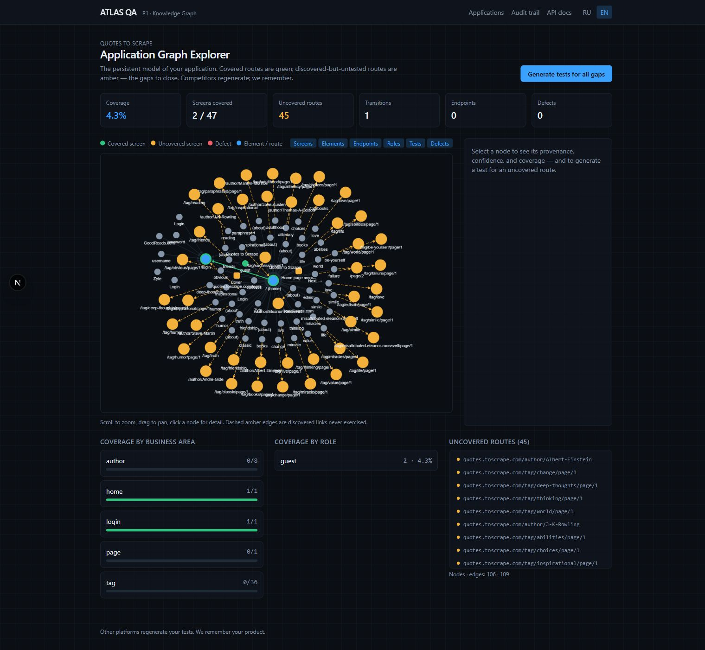
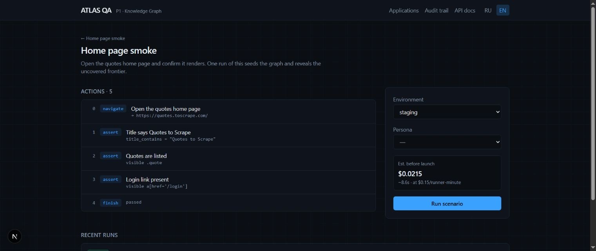
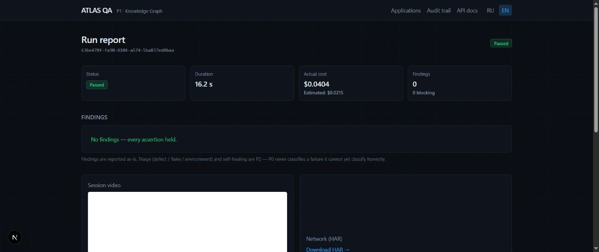

# ATLAS QA
### Remember the application, not just the last test run.

A QA workspace that turns browser observations into a persistent application graph. Test results show what happened; the graph shows what has been discovered, what has been exercised and which routes still need attention.

*The actual local Graph Explorer for the Quotes to Scrape practice site: 2 of 47 discovered screens covered and 45 still untested.*

## Passing one test is not knowing the product

A home-page smoke test may pass while most of an application remains untouched. ATLAS records discovered screens and links so that an observed route can exist in the model before a test has exercised it. This makes the frontier visible instead of confusing “not tested” with “not present.”

In the recorded practice-site example, the home page and login route are covered. Author pages, pagination and tag routes remain uncovered. The graph shows 106 nodes and 109 edges across the observed model; its 4.3% figure is **discovered-screen coverage**, not code coverage or a claim that only 4.3% of all possible behaviours exist.

## Begin with an explicit scenario

A scenario contains typed actions and assertions. The example opens the practice site, checks its title, verifies that quote elements are visible and checks for the login link. Environment and persona are chosen before a run, and the UI shows a cost estimate.

*The smoke scenario exposes its five actions, target environment, persona and previously recorded run.*

This explicit starting point provides a useful baseline for more advanced automation. A reported failure can be connected to the action that produced it rather than attributed to an opaque agent narrative.

## Keep the artifacts with the outcome

The run report contains status, duration, estimated and actual runner cost, findings and individual steps. Browser artifacts include screenshots, DOM evidence, session video and a network HAR. These give a reviewer material for investigating the result after the browser session has ended.

*A previously recorded passing run: 16.2 seconds, no failed assertions and links to captured artifacts. The displayed cost is the project’s runner-cost calculation.*

The report does not automatically label every failure as an application defect. Defect/flake/environment triage and self-healing belong to later work; presenting that uncertainty is preferable to giving an unsupported diagnosis.

## Close a gap in the graph

The Graph Explorer separates screens, elements, endpoints, roles, tests and defects. A selected node can expose provenance, confidence and coverage. Generated gap scenarios use observed routes and links to turn discovered-but-uncovered areas into concrete tests.

~~~mermaid
flowchart LR
 A[Typed scenario and persona] --> B[Browser executor]
 B --> C[DOM, screenshots, video and HAR]
 C --> D[Persistent application graph]
 D --> E[Coverage by area and role]
 E --> F[Uncovered route]
 F --> G[Generated gap scenario]
 G --> B
 C --> H[Run report and audit trail]
~~~

The practice application already has a smoke scenario and 12 generated route scenarios. The screenshots inspect existing runs and graph state; no new external test run was launched to make this case study.

## Engineering scope

**Frontend:** Next.js 15 and TypeScript with a graph-exploration interface. **Service:** FastAPI, application/scenario/run models, audit events and artifact storage. The executor uses a typed action contract, while the persistent model keeps observations across runs. Local storage supports development, with database and object-storage paths designed separately from the UI.

The implemented P0/P1 work covers execution, artifacts, a persistent graph, coverage views and deterministic gap scenarios. A general autonomous planner, reliable self-healing and broad failure classification are not claimed here. The project’s core shift is from disposable test output to a product model that can guide the next test.

---

### Built by

[Shakhnazar Akhmer](https://github.com/Eye172).

[More projects](https://github.com/Eye172) · [Contact](mailto:shakh090909@gmail.com)

This repository presents the product and its engineering. Implementation and internal data are maintained separately. Screenshots and documented experiments are identified in their captions.
