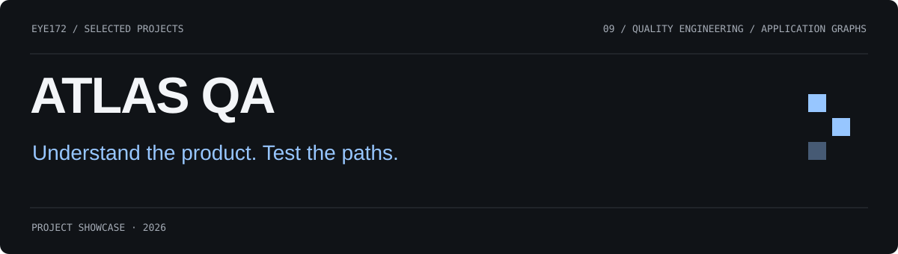
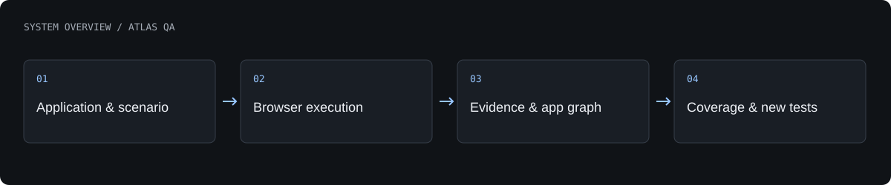

# ATLAS QA

An application-testing platform connecting reproducible browser runs, evidence capture and a persistent model of the product.

**QAAI implementation · P0/P1 foundation**

[What is built](#what-is-built) · [Architecture](#architecture) · [Authors](#authors) · [Profile](https://github.com/Eye172)

## What is built

- Register an application, launch a scenario and inspect its report.
- Capture screenshots, DOM snapshots, video and network evidence.
- Build a versioned graph of screens, elements, transitions, roles and defects.
- Find uncovered paths and generate deterministic follow-up scenarios.

## Architecture

A portal submits runs to an API and browser runner. Observed behaviour updates the application knowledge graph, which supports coverage inspection and generation of missing-path scenarios. Artifact storage and tenancy are separated from execution.

**Technology:** Python · FastAPI · Next.js · Playwright · SQLite / PostgreSQL · Local storage / S3.

## Current scope

P0 foundation and P1 graph workflows are implemented. Autonomous user populations, advanced LLM planning, self-healing and large-scale multi-agent testing remain later stages.

## Authors

[Shakhnazar Akhmer](https://github.com/Eye172).

## About this repository

This is a standalone project showcase containing a product description, visuals and a high-level architecture overview. Implementation source, model weights, credentials and internal project materials are not distributed here. No deployment is required to explore this page.

[Contact](mailto:shakh090909@gmail.com) · [GitHub profile](https://github.com/Eye172)
